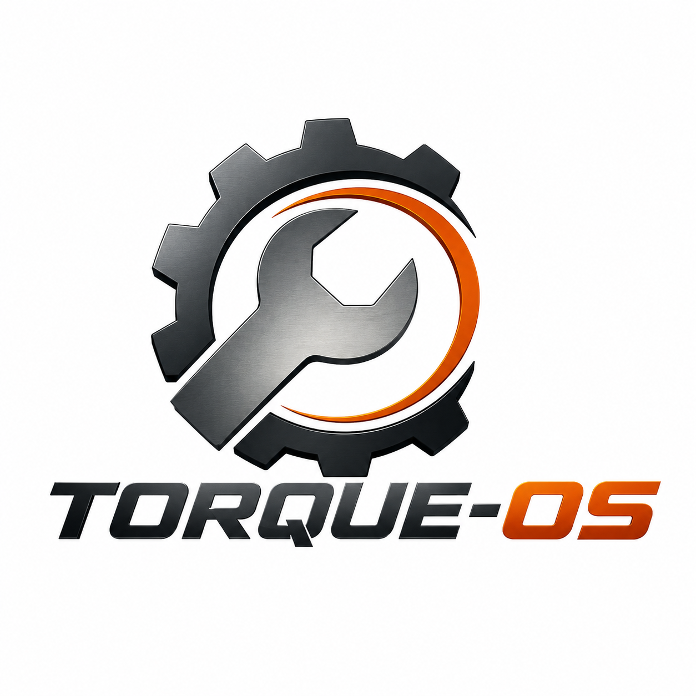

<p align="center">
  
</p>

# mechanics-software

Backend API for a mechanic shop — the core application of the [Torque-OS](https://github.com/Torque-OS) platform. Built as the Tech Challenge for FIAP POS Tech (15SOAT).

> **Part of the [Torque-OS](https://github.com/Torque-OS) platform** — see [how repos link together](#platform-overview) below.

---

## Platform Overview

```
Internet
  │
  └─ API Gateway (HTTP API v2)         ← mechanics-infra-k8s
        │
        ├── POST /auth  ── Lambda CPF Auth    ← mechanics-lambda
        │                       │
        │               RDS PostgreSQL 16     ← mechanics-infra-db
        │
        ├── POST /api/auth/login  ─────────────────────────────────────┐
        ├── GET  /health          ─────────────────────────────────────┤ no authorizer
        │                                                              │
        └── ANY /{proxy+}  ── Lambda Authorizer  ← mechanics-lambda   │
                  │ (JWT valid)                                        │
                  ▼                                                    ▼
               VPC Link ── NLB ── EKS Pods (THIS REPO) ──── RDS PostgreSQL 16
                                        │                   ← mechanics-infra-db
                          GatewayKeyMiddleware validates
                          X-Gateway-Key header
```

**This repo** is the API that runs inside EKS. All external traffic passes through the API Gateway — the cluster load balancer has no public address.

---

## What This Repo Does

A RESTful API that manages the full lifecycle of service orders for an auto repair shop:

- **Customers & Vehicles** — CRUD with Brazilian document types (CPF/CNPJ).
- **Parts & Services Catalogue** — inventory with stock tracking.
- **Service Orders** — full lifecycle: RECEIVED → IN_DIAGNOSIS → AWAITING_APPROVAL → IN_EXECUTION → COMPLETED → DELIVERED (or CANCELLED).
- **Budget** — generated per service order, approved or rejected by the customer.
- **Email notifications** — every status transition sends an email to the customer via SMTP.
- **Staff authentication** — email + password login at `POST /api/auth/login`; customers authenticate by CPF via `mechanics-lambda`.
- **Gateway Key** — validates that requests arrived through the API Gateway (defence in depth).

**Stack:** C# 12 · ASP.NET Core 8 · Entity Framework Core 8 · PostgreSQL 16  
**Architecture:** Clean Architecture + DDD Domain — see [`docs/decisions/`](./docs/decisions/)

---

## Prerequisites

| Tool | Version | Notes |
|---|---|---|
| [.NET 8 SDK](https://dotnet.microsoft.com/download/dotnet/8.0) | 8.x | `dotnet --version` |
| [Docker](https://www.docker.com/products/docker-desktop) | ≥ 24 | for `docker compose` |
| [kubectl](https://kubernetes.io/docs/tasks/tools/) | ≥ 1.28 | for Kubernetes deploy |
| [AWS CLI](https://aws.amazon.com/cli/) | ≥ 2 | for EKS kubeconfig |

---

## Running Locally

### Option A — Docker Compose (recommended)

Starts the API and PostgreSQL together:

```bash
docker compose up --build
```

| Endpoint | URL |
|---|---|
| API | `http://localhost:8080` |
| Swagger UI | `http://localhost:8080/swagger` |
| PostgreSQL | `localhost:5435` |

Migrations and the default admin user are applied automatically on startup.

### Option B — dotnet run

**1. Start only the database:**

```bash
docker compose up db -d
```

**2. Configure environment variables:**

```bash
cp env.example .env
# defaults work for local dev — no changes needed for a quick start
```

**3. Restore the local EF Core tool and run:**

```bash
dotnet tool restore
dotnet run --project src/MechanicsSoftware.API/MechanicsSoftware.API.csproj
```

| Endpoint | URL |
|---|---|
| API | `http://localhost:5066` |
| Swagger UI | `http://localhost:5066/swagger` |

---

## Environment Variables

All variables with a default work out of the box for local development. Production values are provided via Kubernetes Secrets (rendered by `k8s/secret.yaml` in CI/CD).

| Variable | Required | Description | Default |
|---|---|---|---|
| `ConnectionStrings__DefaultConnection` | Yes | PostgreSQL connection string | set in `appsettings.Development.json` |
| `JWT_SECRET` | Yes | Signing secret — **min 32 chars** — **must match `mechanics-lambda`** | pre-configured for dev |
| `JWT_EXPIRATION_MINUTES` | No | Token lifetime in minutes | `60` |
| `GATEWAY_KEY` | No* | Shared secret with API Gateway. When set, requests without `X-Gateway-Key` are rejected with 403. Leave empty locally. | `` (disabled) |
| `BCRYPT_SALT_ROUNDS` | No | BCrypt cost factor | `12` |
| `SEED_ADMIN_EMAIL` | No | Auto-created admin email | `admin@mechanics.local` |
| `SEED_ADMIN_PASSWORD` | No | Auto-created admin password | `Admin@123` |
| `SMTP_HOST` | Yes (email) | SMTP server hostname | — |
| `SMTP_PORT` | Yes (email) | SMTP port — use `587` (STARTTLS) | — |
| `SMTP_USER` | Yes (email) | SMTP username | — |
| `SMTP_PASS` | Yes (email) | SMTP password or App Password | — |
| `SMTP_FROM` | Yes (email) | Sender address | — |

> *`GATEWAY_KEY` must match the `gateway_key` Terraform variable in `mechanics-infra-k8s`.

---

## Authentication

### Staff login

```http
POST /api/auth/login
Content-Type: application/json

{
  "email": "admin@mechanics.local",
  "password": "Admin@123"
}
```

```json
{ "token": "eyJhbGciOiJIUzI1NiIsInR5cCI6IkpXVCJ9..." }
```

Use `Authorization: Bearer <token>` on all protected endpoints.

### Default admin credentials

| Field | Value |
|---|---|
| Email | `admin@mechanics.local` |
| Password | `Admin@123` |

Override with `SEED_ADMIN_EMAIL` / `SEED_ADMIN_PASSWORD`.

### Swagger UI

1. Open `/swagger`
2. Click **Authorize** (🔒)
3. Paste the token → **Authorize**

---

## API Endpoints

### Public (no token required)

| Method | Endpoint | Description |
|---|---|---|
| `POST` | `/api/auth/login` | Staff login — returns JWT |
| `GET` | `/api/service-orders/{id}/status` | Customer status check (shareable link) |
| `GET` | `/health` | Liveness/readiness probe |

### Protected (JWT required)

| Resource | Endpoints |
|---|---|
| Customers | `GET/POST /api/customers` · `GET/PUT/DELETE /api/customers/{id}` |
| Vehicles | `GET/POST /api/vehicles` · `GET/PUT/DELETE /api/vehicles/{id}` |
| Parts | `GET/POST /api/parts` · `GET/PUT/DELETE /api/parts/{id}` · `PATCH /api/parts/{id}/stock` |
| Services | `GET/POST /api/services` · `GET/PUT/DELETE /api/services/{id}` |
| Service Orders | `GET/POST /api/service-orders` · lifecycle endpoints below |

### Service Order Lifecycle

```
RECEIVED → IN_DIAGNOSIS → AWAITING_APPROVAL → IN_EXECUTION → COMPLETED → DELIVERED
                                   ↓
                               CANCELLED
```

| Step | Endpoint |
|---|---|
| Start diagnosis | `POST /api/service-orders/{id}/start-diagnosis` |
| Add service item | `POST /api/service-orders/{id}/services` |
| Add part item | `POST /api/service-orders/{id}/parts` |
| Generate budget | `POST /api/service-orders/{id}/budget` |
| Send budget | `POST /api/service-orders/{id}/send-budget` |
| Approve/reject | `POST /api/service-orders/{id}/budget-decision` with `{ "decision": "approve" \| "reject" }` |
| Start execution | `POST /api/service-orders/{id}/start-execution` |
| Complete | `POST /api/service-orders/{id}/complete` |
| Deliver | `POST /api/service-orders/{id}/deliver` |

Full schemas available at `/swagger`.

### Quick Examples

#### Create a customer

```http
POST /api/customers
Authorization: Bearer <JWT>
Content-Type: application/json

{
  "name": "João da Silva",
  "documentValue": "529.982.247-25",
  "personType": "INDIVIDUAL",
  "email": "joao@example.com",
  "phone": "(11) 99999-0001"
}
```

#### Open a service order

```http
POST /api/service-orders
Authorization: Bearer <JWT>
Content-Type: application/json

{
  "customerId": "<customer-id>",
  "vehicleId": "<vehicle-id>"
}
```

```json
{ "id": "<order-id>", "status": "RECEIVED" }
```

#### Check status (public, no token)

```http
GET /api/service-orders/<order-id>/status
```

```json
{ "status": "IN_EXECUTION" }
```

---

## Testing

### Unit tests

```bash
dotnet test tests/MechanicsSoftware.UnitTests
```

### Unit tests with coverage report

```bash
dotnet test tests/MechanicsSoftware.UnitTests \
  --collect:"XPlat Code Coverage" \
  --settings coverlet.runsettings \
  --results-directory ./coverage-results
```

### Integration tests

Require Docker (PostgreSQL is started automatically via Testcontainers):

```bash
dotnet test tests/MechanicsSoftware.IntegrationTests
```

### Coverage threshold

CI enforces **80% line coverage**. HTML report: [rnataoliveira.github.io/mechanics-software](https://rnataoliveira.github.io/mechanics-software/)

---

## Database Migrations

The project pins `dotnet-ef` in `.config/dotnet-tools.json`. Run `dotnet tool restore` once.

```bash
# Apply all pending migrations
dotnet dotnet-ef database update \
  --project src/MechanicsSoftware.Infrastructure/MechanicsSoftware.Infrastructure.csproj \
  --startup-project src/MechanicsSoftware.API/MechanicsSoftware.API.csproj

# Add a new migration
dotnet dotnet-ef migrations add <Name> \
  --project src/MechanicsSoftware.Infrastructure/MechanicsSoftware.Infrastructure.csproj \
  --startup-project src/MechanicsSoftware.API/MechanicsSoftware.API.csproj \
  --output-dir Persistence/Migrations

# Remove last migration (only if not applied)
dotnet dotnet-ef migrations remove \
  --project src/MechanicsSoftware.Infrastructure/MechanicsSoftware.Infrastructure.csproj \
  --startup-project src/MechanicsSoftware.API/MechanicsSoftware.API.csproj
```

In production (EKS), migrations run in an **init container** before the API pod starts — see [ADR-006](./docs/decisions/ADR-006-database-migration-strategy.md).

---

## Kubernetes Deploy

Manifests in `k8s/` target the EKS cluster provisioned by `mechanics-infra-k8s`.

| File | Purpose |
|---|---|
| `namespace.yaml` | `mechanics-software` namespace |
| `configmap.yaml` | Non-secret configuration |
| `secret.yaml` | DB connection string, JWT secret, SMTP, Gateway Key |
| `deployment-api.yaml` | API Deployment with EF migrations init container |
| `service-api.yaml` | Internal NLB — only reachable via API Gateway VPC Link |
| `hpa.yaml` | HPA: 2–10 replicas, scale at 70% CPU |

> From Fase 3, PostgreSQL runs on RDS. Do **not** apply `deployment-db.yaml` / `pvc.yaml` to the cloud cluster.

### Manual apply

```bash
# Get kubeconfig
aws eks update-kubeconfig --name mechanics-software --region us-east-1

# Apply (secret.yaml uses envsubst — set the vars first or let CI render them)
kubectl apply -f k8s/

# Watch the rollout (init container runs migrations first)
kubectl rollout status deployment/mechanics-software-api -n mechanics-software

# Confirm the NLB is ready (needed for mechanics-infra-k8s pass 2)
kubectl get svc mechanics-software-api -n mechanics-software
```

---

## CI/CD Pipeline

| Workflow | File | Trigger | What it does |
|---|---|---|---|
| Coverage Report | `.github/workflows/coverage.yml` | Every PR/push to `main` | Build → unit tests → 80% gate → GitHub Pages |
| Deploy | `.github/workflows/deploy.yml` | After Coverage passes on `main` | Docker build → GHCR push → init container migrations → `kubectl apply` |

### GitHub Secrets required

| Secret | Description |
|---|---|
| `AWS_ACCESS_KEY_ID` | AWS Academy key |
| `AWS_SECRET_ACCESS_KEY` | AWS Academy secret |
| `AWS_SESSION_TOKEN` | AWS Academy session token (rotate each lab session) |
| `DB_PASSWORD` | RDS master password (from `mechanics-infra-db` output) |
| `JWT_SECRET` | **Must match `mechanics-lambda`** |
| `GATEWAY_KEY` | **Must match `gateway_key` in `mechanics-infra-k8s`** |
| `SMTP_HOST` | SMTP server |
| `SMTP_PORT` | SMTP port |
| `SMTP_USER` | SMTP username |
| `SMTP_PASS` | SMTP password |
| `SMTP_FROM` | Sender address |

```bash
gh secret set JWT_SECRET    --repo Torque-OS/mechanics-software
gh secret set GATEWAY_KEY   --repo Torque-OS/mechanics-software
gh secret set DB_PASSWORD   --repo Torque-OS/mechanics-software
gh secret set SMTP_HOST     --repo Torque-OS/mechanics-software
# ... etc
```

---

## Project Structure

```
src/
  MechanicsSoftware.Domain/          # Entities, value objects, domain rules (pure — no framework)
  MechanicsSoftware.Application/     # Use cases (Commands, Handlers, Queries), abstractions
  MechanicsSoftware.Infrastructure/  # EF Core, JWT, BCrypt, SmtpEmailNotifier, GatewayKey
  MechanicsSoftware.API/             # Controllers, middleware, Swagger, DI composition root

tests/
  MechanicsSoftware.UnitTests/        # Domain + Application + Infrastructure unit tests
  MechanicsSoftware.IntegrationTests/ # Full HTTP tests (WebApplicationFactory + Testcontainers)

k8s/                                 # Kubernetes manifests
docs/
  decisions/                         # ADR-001 → ADR-009
  rfc/                               # RFC-001 (Fase 3 architecture)
  domain/                            # Event Storming, Ubiquitous Language, Bounded Contexts
  architecture/                      # Architecture overview
```

---

## Documentation

| Document | |
|---|---|
| Architecture Overview | [`docs/architecture/overview.md`](./docs/architecture/overview.md) |
| RFC-001 — Fase 3 decisions | [`docs/rfc/RFC-001-fase3-cloud-db-auth.md`](./docs/rfc/RFC-001-fase3-cloud-db-auth.md) |
| ADR-006 DB Migration Strategy | [`docs/decisions/ADR-006-database-migration-strategy.md`](./docs/decisions/ADR-006-database-migration-strategy.md) |
| ADR-007 Communication Pattern | [`docs/decisions/ADR-007-communication-pattern.md`](./docs/decisions/ADR-007-communication-pattern.md) |
| ADR-008 Lambda Authorizer | [`docs/decisions/ADR-008-lambda-authorizer.md`](./docs/decisions/ADR-008-lambda-authorizer.md) |
| ADR-009 HPA Autoscaling | [`docs/decisions/ADR-009-hpa-autoscaling.md`](./docs/decisions/ADR-009-hpa-autoscaling.md) |
| Event Storming | [`docs/domain/event-storming.md`](./docs/domain/event-storming.md) |
| Ubiquitous Language | [`docs/domain/ubiquitous-language.md`](./docs/domain/ubiquitous-language.md) |
| Aggregates & Entities | [`docs/domain/aggregates-and-entities.md`](./docs/domain/aggregates-and-entities.md) |
| Bounded Contexts | [`docs/domain/bounded-contexts.md`](./docs/domain/bounded-contexts.md) |
| ADR-001 Tech Stack | [`docs/decisions/ADR-001-tech-stack.md`](./docs/decisions/ADR-001-tech-stack.md) |
| ADR-002 Architecture | [`docs/decisions/ADR-002-architecture.md`](./docs/decisions/ADR-002-architecture.md) |
| ADR-003 Database | [`docs/decisions/ADR-003-database.md`](./docs/decisions/ADR-003-database.md) |
| ADR-004 Application Layer | [`docs/decisions/ADR-004-application-layer-conventions.md`](./docs/decisions/ADR-004-application-layer-conventions.md) |
| ADR-005 Clean Architecture Migration | [`docs/decisions/ADR-005-clean-architecture-migration.md`](./docs/decisions/ADR-005-clean-architecture-migration.md) |
| Database Justification + ER Diagram | [`docs/database/database-justification.md`](./docs/database/database-justification.md) |
| Postman Collection | [`MechanicsSoftware.postman_collection.json`](./MechanicsSoftware.postman_collection.json) |

---

## Related Repositories

| Repo | Role |
|---|---|
| [mechanics-lambda](https://github.com/Torque-OS/mechanics-lambda) | CPF auth + JWT authorizer — deploy before API Gateway |
| [mechanics-infra-k8s](https://github.com/Torque-OS/mechanics-infra-k8s) | VPC + EKS + API Gateway Terraform |
| [mechanics-infra-db](https://github.com/Torque-OS/mechanics-infra-db) | RDS PostgreSQL Terraform |
