# Component Diagram — Fase 3 Cloud Architecture

**Issue:** F3-27

Full platform view across all four repositories, showing every AWS component, how they connect, and which GitHub repository provisions or deploys each one.

---

## Diagram

```mermaid
flowchart TB
    %% ── External actors ──────────────────────────────────────────────
    Client(["👤 Client\n(browser / mobile / curl)"])
    SMTP(["📧 SMTP Server\n(email notifications)"])

    %% ── GitHub ───────────────────────────────────────────────────────
    subgraph GitHub["GitHub — Torque-OS"]
        direction TB
        GHCR["📦 GHCR\nContainer Registry\nghcr.io/torque-os/mechanics-software"]

        subgraph CI["GitHub Actions CI/CD"]
            CI_K8S["mechanics-infra-k8s\nterraform apply"]
            CI_DB["mechanics-infra-db\nterraform apply"]
            CI_LAMBDA["mechanics-lambda\nnpm test → zip → aws lambda update"]
            CI_APP["mechanics-software\ndocker build → push GHCR\nkubectl apply"]
        end
    end

    %% ── AWS ──────────────────────────────────────────────────────────
    subgraph AWS["AWS — us-east-1"]
        APIGW["🌐 API Gateway\nHTTP API v2\n(regional — outside VPC)"]
        CW["📊 CloudWatch Logs\n(access logs)"]

        subgraph VPC["VPC — 10.0.0.0/16  (mechanics-infra-k8s)"]
            direction TB

            subgraph PublicSubnets["Public subnets — 3 AZs"]
                NGW["NAT Gateway"]
            end

            subgraph PrivateSubnets["Private subnets — 3 AZs"]
                direction TB

                subgraph EKS["EKS Cluster — mechanics-software  (t3.small, 1–3 nodes)"]
                    direction TB
                    subgraph NS["Namespace: mechanics-software"]
                        HPA["HPA\nmin 2 · max 10 · cpu 70%"]
                        DEP["Deployment\nASP.NET Core 8\n2–10 pods"]
                        SVC["Service\n(internal NLB)"]
                        INIT["initContainer\ndotnet-ef migrate"]
                        CM["ConfigMap"]
                        SEC["Secret\n(JWT_SECRET, DB, SMTP, GATEWAY_KEY)"]
                    end
                end

                VPCLINK["VPC Link"]
                NLB["NLB\n(internal)"]

                subgraph Lambdas["Lambda functions  (mechanics-lambda)"]
                    L_ISSUER["⚡ mechanics-lambda\nPOST /auth\nhandler.js\n— CPF validation\n— JWT signing"]
                    L_AUTHZ["⚡ mechanics-lambda-authorizer\nLambda Authorizer\nauthorizer.js\n— JWT verification\n— cache 300 s"]
                end

                RDS[("🐘 RDS PostgreSQL 16\ndb.t3.micro\nmechanicssoftware\n(mechanics-infra-db)")]
            end
        end
    end

    %% ── Request path — token issuance ────────────────────────────────
    Client -->|"POST /auth\n{cpf}"| APIGW
    APIGW -->|"invoke\n(no authorizer)"| L_ISSUER
    L_ISSUER -->|"SELECT document, active\nWHERE document = cpf"| RDS
    L_ISSUER -->|"200 {token}"| APIGW
    APIGW -->|"200 {token}"| Client

    %% ── Request path — protected routes ──────────────────────────────
    Client -->|"ANY /{proxy+}\nAuthorization: Bearer JWT"| APIGW
    APIGW -->|"invoke authorizer\n(cached per token)"| L_AUTHZ
    L_AUTHZ -->|"isAuthorized: true/false"| APIGW
    APIGW -->|"X-Gateway-Key\n+ Authorization header"| VPCLINK
    VPCLINK --> NLB
    NLB --> SVC
    SVC --> DEP

    %% ── API → data / email ───────────────────────────────────────────
    DEP -->|"EF Core + Npgsql\nTCP 5432"| RDS
    DEP -->|"SmtpEmailNotifier\nstatus change notifications"| SMTP

    %% ── Internal K8s wiring ──────────────────────────────────────────
    HPA -.->|"scales"| DEP
    INIT -.->|"runs before API starts"| DEP
    CM -.->|"env vars"| DEP
    SEC -.->|"env vars"| DEP

    %% ── CI/CD deploy paths ───────────────────────────────────────────
    CI_APP -->|"docker push"| GHCR
    GHCR -->|"image pull"| DEP
    CI_APP -->|"kubectl apply"| EKS
    CI_LAMBDA -->|"aws lambda update-function-code"| Lambdas
    CI_K8S -->|"terraform apply\n(VPC + EKS + API GW)"| VPC
    CI_K8S -->|"terraform apply\n(API GW + VPC Link)"| APIGW
    CI_DB -->|"terraform apply\n(RDS + SG + subnet group)"| RDS

    %% ── Logging ──────────────────────────────────────────────────────
    APIGW -->|"access logs"| CW

    %% ── Styles ───────────────────────────────────────────────────────
    style AWS fill:#f0f7ff,stroke:#4a90d9
    style VPC fill:#e8f4e8,stroke:#5a9e5a
    style PublicSubnets fill:#fff9e6,stroke:#c8a000
    style PrivateSubnets fill:#f0f7ff,stroke:#4a90d9
    style EKS fill:#e6f0ff,stroke:#3a7bd5
    style NS fill:#d9e8ff,stroke:#2a6bc5
    style Lambdas fill:#fff0e6,stroke:#e07000
    style GitHub fill:#f5f5f5,stroke:#888
    style CI fill:#eeeeee,stroke:#aaa
    style RDS fill:#fce8e8,stroke:#c03030
    style APIGW fill:#fff0e6,stroke:#e07000
```



---

## Component inventory

### External

| Component | Description |
|-----------|-------------|
| Client | Any HTTP client — browser, mobile app, or `curl` |
| SMTP Server | External mail relay used by `SmtpEmailNotifier` to send status-change notifications to customers |

### GitHub (Torque-OS org)

| Component | Repo | What it does |
|-----------|------|-------------|
| GHCR | mechanics-software | Stores the Docker image built by CI |
| CI — terraform apply (VPC+EKS) | mechanics-infra-k8s | Provisions VPC, subnets, EKS cluster, NAT Gateway, and API Gateway (pass 2) |
| CI — terraform apply (RDS) | mechanics-infra-db | Provisions RDS instance, DB subnet group, security group |
| CI — lambda deploy | mechanics-lambda | Runs `npm test`, zips source, calls `aws lambda update-function-code` for both functions |
| CI — app deploy | mechanics-software | Builds Docker image, pushes to GHCR, applies K8s manifests to EKS |

### AWS — outside VPC

| Component | Service | Notes |
|-----------|---------|-------|
| API Gateway | HTTP API v2 | Regional endpoint — single entry point for all client traffic. Routes `POST /auth` to the issuer Lambda and `ANY /{proxy+}` through the authorizer then to the VPC Link |
| CloudWatch Logs | CloudWatch | API Gateway access logs |

### AWS — inside VPC (private subnets)

| Component | Service | Provisioned by | Notes |
|-----------|---------|---------------|-------|
| NLB | Network Load Balancer | mechanics-software (K8s `Service`) | Internal — never exposed to the internet; reachable only via VPC Link |
| VPC Link | API Gateway VPC Link | mechanics-infra-k8s | Connects API Gateway to the internal NLB |
| EKS Node Group | EC2 t3.small | mechanics-infra-k8s | 1–3 nodes; HPA scales pods within the node budget |
| HPA | Kubernetes HPA | mechanics-software | min 2 / max 10 pods; scales on CPU ≥ 70% |
| Deployment | Kubernetes Deployment | mechanics-software | Runs the ASP.NET Core 8 API; initContainer applies EF migrations before the API starts |
| ConfigMap / Secret | Kubernetes | mechanics-software | Non-secret env vars in ConfigMap; `JWT_SECRET`, `DATABASE_URL`, `SMTP_*`, `GATEWAY_KEY` in Secret |
| mechanics-lambda | AWS Lambda (Node.js 20) | mechanics-lambda | `handler.js` — validates CPF, queries `customers` table, issues JWT |
| mechanics-lambda-authorizer | AWS Lambda (Node.js 20) | mechanics-lambda | `authorizer.js` — verifies JWT; result cached 300 s per token at API Gateway |
| RDS PostgreSQL 16 | db.t3.micro | mechanics-infra-db | Single database `mechanicssoftware`; consumed by both the API and the issuer Lambda |

---

## Request paths

### Token issuance (`POST /auth`)

```
Client → API Gateway → mechanics-lambda (handler.js)
                              │
                              ├─ validate CPF format + check digits
                              ├─ SELECT document, active FROM customers WHERE document = $1
                              └─ sign JWT (HS256) → return { token }
```

No authorizer on this route — it is the authentication entry point.

### Protected routes (`ANY /{proxy+}`)

```
Client → API Gateway → mechanics-lambda-authorizer (authorizer.js)
                              │
                              ├─ verify JWT (HS256, iss, aud, exp) — no DB access
                              └─ isAuthorized: true/false → cached 300 s

         API Gateway → inject X-Gateway-Key → VPC Link → NLB → Service
                                                                    │
                                                               Deployment (pod)
                                                                    │
                              ┌─────────────────────────────────────┘
                              ├─ GatewayKeyMiddleware (FixedTimeEquals)
                              ├─ JwtBearer re-validates token
                              ├─ Authorization policy (role check)
                              └─ handler → EF Core → RDS → response
```

### Deploy paths (CI/CD)

```
mechanics-infra-k8s  → terraform apply → VPC + EKS + API Gateway
mechanics-infra-db   → terraform apply → RDS + subnet group + SG
mechanics-lambda     → npm test + zip  → aws lambda update-function-code (both functions)
mechanics-software   → docker build    → push GHCR → kubectl apply → EKS
```

**Deploy order constraint:** `mechanics-infra-k8s` pass 1 must complete before `mechanics-infra-db`. `mechanics-lambda` must deploy before `mechanics-infra-k8s` pass 2 (API Gateway reads both Lambda ARNs via `data "aws_lambda_function"`). See [RFC-001](../rfc/RFC-001-fase3-cloud-db-auth.md) for full justification.

---

## Related

- [RFC-001 — Cloud, database, and auth design decisions](../rfc/RFC-001-fase3-cloud-db-auth.md)
- [ADR-007 — Communication pattern (HTTP API v2 + VPC Link)](../decisions/ADR-007-communication-pattern.md)
- [ADR-008 — Lambda Authorizer design](../decisions/ADR-008-lambda-authorizer.md)
- [ADR-009 — HPA autoscaling](../decisions/ADR-009-hpa-autoscaling.md)
- [Database Justification + ER Diagram](../database/database-justification.md)
- [Sequence — CPF Authentication](./sequence-cpf-auth.md)
- [Sequence — Service Order Opening](./sequence-service-order-opening.md)
