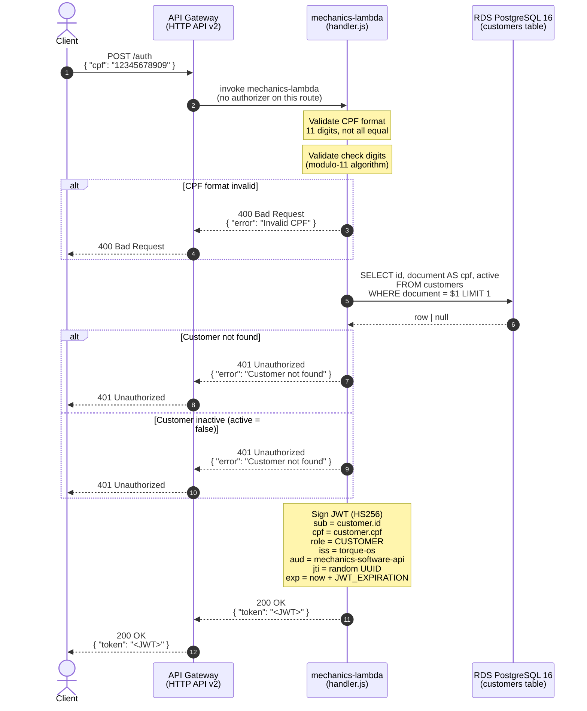
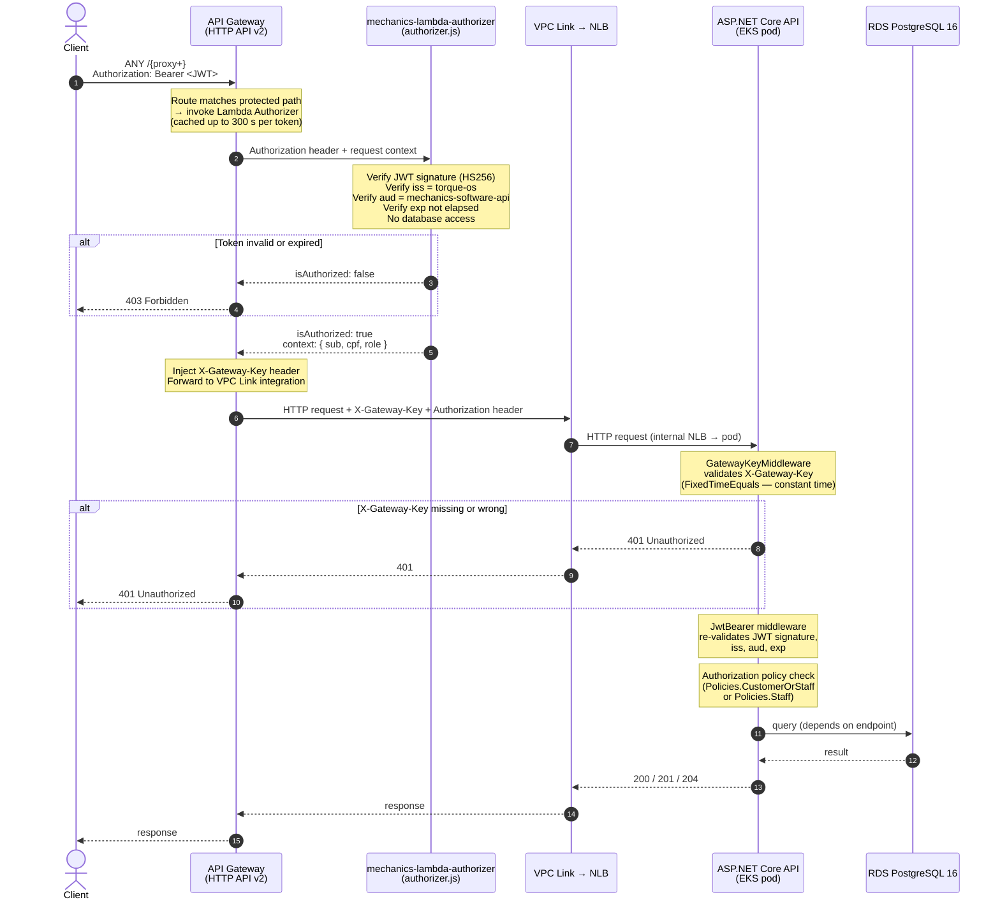

# Sequence Diagram — CPF Authentication Flow

**Issue:** F3-28  
**Repo:** mechanics-lambda + mechanics-infra-k8s (API Gateway)

The CPF auth flow has two distinct sub-flows:

1. **Token issuance** — client exchanges a CPF for a JWT (`POST /auth`)
2. **Authorized request** — subsequent requests carry the JWT; the Lambda Authorizer validates it before the API receives it

---

## Part 1 — Token Issuance (`POST /auth`)

---

## Part 2 — Authorized Request (any protected route)

After obtaining a token, the client includes it as `Authorization: Bearer <JWT>` on every subsequent call. The Lambda Authorizer intercepts the request before it reaches the API.

---

## Security layers summary

| Layer | Who enforces | What it checks |
|-------|-------------|---------------|
| Lambda Authorizer | API Gateway | JWT signature, issuer, audience, expiry |
| `GatewayKeyMiddleware` | ASP.NET Core API | `X-Gateway-Key` header — defence in depth against traffic bypassing API Gateway |
| `JwtBearer` middleware | ASP.NET Core API | JWT re-validation (signature + claims) |
| Authorization policy | ASP.NET Core API | `role` claim — distinguishes `CUSTOMER` from staff |

The API validates the JWT a second time (step 10) even though the authorizer already did it. This is intentional: the NLB endpoint is internal, but re-validation ensures no forged request can reach business logic even if the network perimeter is compromised.

---

## Related

- [RFC-001 — Cloud, database, and auth design decisions](../rfc/RFC-001-fase3-cloud-db-auth.md)
- [ADR-007 — Communication pattern (HTTP API v2 + VPC Link)](../decisions/ADR-007-communication-pattern.md)
- [ADR-008 — Lambda Authorizer design](../decisions/ADR-008-lambda-authorizer.md)
- [Sequence — Service order opening](./sequence-service-order-opening.md)
