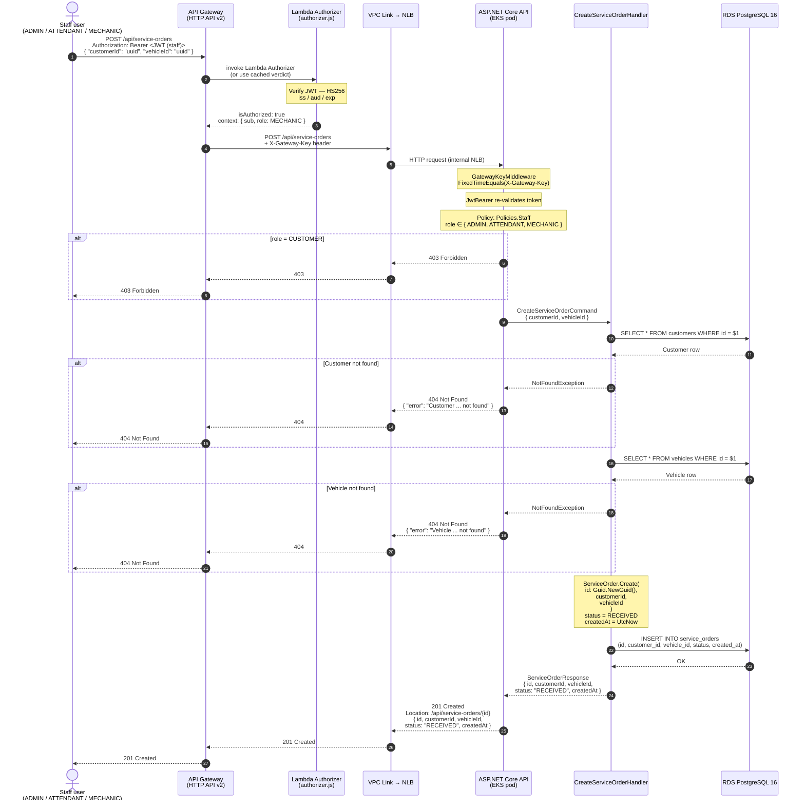

# Sequence Diagram — Service Order Opening

**Issue:** F3-29  
**Endpoint:** `POST /api/service-orders`  
**Authorization:** `Policies.Staff` (role must be `ADMIN`, `ATTENDANT`, or `MECHANIC`)

Opening a service order is a staff-only operation. The customer is identified by their existing `customerId`; the vehicle must already exist and belong to that customer.

---

## Flow



---

## Notes

**Vehicle ownership is not validated at creation time.** The handler only checks that both the customer and vehicle exist; it does not verify that the vehicle's `customer_id` matches the provided `customerId`. This is intentional for the current scope — a vehicle can have been registered independently before being associated with a service order.

**`ServiceOrder.Create` is a pure domain method.** It does not query the database; all persistence happens via `IAppDbContext`. The domain entity only enforces internal invariants (e.g., valid UUIDs, initial status must be `RECEIVED`).

**`status = RECEIVED` is the entry point of the lifecycle:**

```
RECEIVED → IN_DIAGNOSIS → AWAITING_APPROVAL → IN_EXECUTION → COMPLETED → DELIVERED
                                   ↓
                               CANCELLED
```

Each subsequent transition has its own endpoint and handler. See [ADR-002](../decisions/ADR-002-architecture.md) for the Vertical Slice + DDD design rationale.

---

## Related

- [Sequence — CPF authentication flow](./sequence-cpf-auth.md)
- [RFC-001 — Cloud, database, and auth design decisions](../rfc/RFC-001-fase3-cloud-db-auth.md)
- [ADR-002 — Architecture (Vertical Slice + DDD)](../decisions/ADR-002-architecture.md)
- [Database ER Diagram](../database/database-justification.md)
