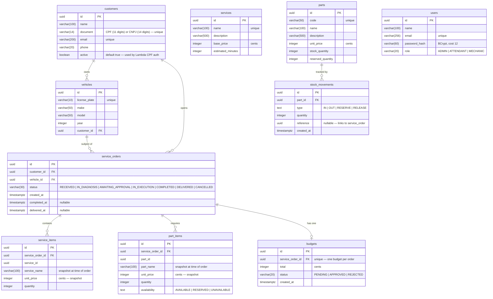

# Database: Formal Justification and Schema Reference

## 1. Technology Choice — PostgreSQL 16

### Decision

The platform uses **PostgreSQL 16** as its single relational database, provisioned as a managed **AWS RDS** instance (`db.t3.micro`) inside the private subnets of the EKS VPC.

### Rationale

| Criterion | PostgreSQL 16 | Alternatives considered |
|-----------|--------------|------------------------|
| **Data model fit** | Strong relational model with FK constraints matches the domain graph (Customer → Vehicle → ServiceOrder → Budget/Items) | MongoDB: schema-less is a liability when business rules enforce state transitions and relational integrity |
| **ACID guarantees** | Full transactional isolation ensures budget approval and stock reservation never leave the system in a partial state | DynamoDB: single-table design loses joins; eventual consistency is unsuitable for financial totals |
| **EF Core / Npgsql** | First-class support — typed migrations, value converters, owned entities, JSONB if needed | MySQL: supported but Npgsql/EF Core ecosystem is richer for .NET |
| **UUID primary keys** | Native `uuid` type, no serial/sequence dependency, safe for distributed inserts | — |
| **Monetary values** | Stored as `integer` (cents) — avoids floating-point rounding entirely | `decimal`/`numeric` also correct but integer cents is simpler and equally precise |
| **Cost** | `db.t3.micro` fits within AWS Academy Learner Lab budget | Aurora: 4× the cost for a dev workload |

### Managed RDS vs. K8s-hosted PostgreSQL

Running PostgreSQL inside Kubernetes (on a `PVC`) was the Fase 2 approach. For Fase 3 we migrated to RDS:

| Aspect | K8s PVC (Fase 2) | RDS (Fase 3) |
|--------|-----------------|--------------|
| Durability | Single replica, PVC on EBS — node failure risks data loss | Multi-AZ optional; automated backups built in |
| Ops overhead | Manual upgrades, WAL management, snapshot schedule | Fully managed: patching, backups, failover |
| Access from Lambda | Requires K8s network path — complex | VPC private subnet — direct TCP, same security group |
| Shared consumer | API and Lambda must share one DB; K8s internal service is not reachable from Lambda | Both consumers connect via VPC CIDR — no extra routing |

The ADR for this decision is documented in [`ADR-003`](../decisions/ADR-003-database.md).

---

## 2. Schema — Entity Relationship Diagram

---

## 3. Design Decisions

### Monetary values as integer (cents)

All prices and totals are stored as `integer` representing the value in **cents** (BRL centavos). This eliminates floating-point rounding errors at the storage level. The application layer converts to/from `decimal` only for display.

### Price snapshots in line items

`service_items.unit_price` and `part_items.unit_price` are **snapshots** taken at the moment the item is added to the order. Changes to the services or parts catalogue do not retroactively alter open or closed orders. `service_name` and `part_name` are also snapshotted for the same reason.

### `active` flag on customers

Added in migration `20260830000001_AddActiveToCustomers`. The Lambda CPF auth function (`mechanics-lambda`) filters `WHERE document = $1 AND active = true` before issuing a JWT, so deactivated customers cannot obtain tokens even if their CPF is known. The API layer does not currently expose an endpoint to deactivate customers — this is intentional; deactivation is an operational action performed directly or via a future admin endpoint.

### `document` column — CPF and CNPJ in one field

Individual customers (CPF, 11 digits) and company customers (CNPJ, 14 digits) share the same `document varchar(14)` column. The domain value object `TaxId` infers `PersonType` from digit count at read time. The unique index `ix_customers_document` enforces uniqueness across both types.

### Budget as owned entity of ServiceOrder

`budgets` is physically a separate table but is modelled as an EF Core owned entity of `ServiceOrder`. This reflects the domain rule: a budget cannot exist without its service order, and there is at most one budget per order (enforced by the unique index `ix_budgets_service_order_id`).

### Stock reservation

`parts.reserved_quantity` tracks inventory committed to in-progress orders but not yet consumed. `stock_movements` records every change with a `type` and an optional `reference` pointing to the service order that triggered it. This gives a complete audit trail without a separate ledger table.

---

## 4. Migration History

| Migration | Applied | Change |
|-----------|---------|--------|
| `20260325001250_InitialCreate` | 2026-03-25 | Full schema: customers, vehicles, parts, services, service orders, budgets, stock movements |
| `20260328232557_AddUsersTable` | 2026-03-28 | `users` table for staff authentication |
| `20260418012052_AddCompletedAtToServiceOrders` | 2026-04-18 | `completed_at` and `delivered_at` on `service_orders` |
| `20260830000001_AddActiveToCustomers` | 2026-08-30 | `active boolean NOT NULL DEFAULT true` on `customers` — required by Lambda CPF auth |

Migrations are applied automatically on pod startup via the `initContainer` in `k8s/deployment-api.yaml`.
